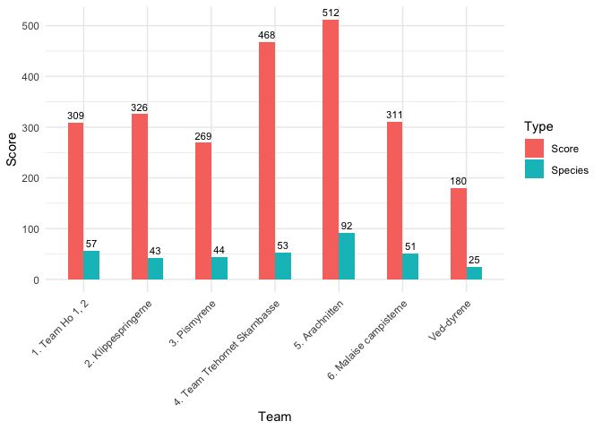

<!-- README.md is generated from README.Rmd. Please edit that file -->

# touRdemols

<!-- badges: start -->
<!-- badges: end -->

The package touRdemols is a collection of functions that can be used to
efficiently calculate and display the standings in a Tour de Mols
competition.

## Background

The competition is a central part of the Arthropod Field Course for
first year undergraduate students at Aarhus University, but can probably
be applied anywhere in the world for any larger taxon. The competition
dates back to …

## The practical stuff

Multiple teams compete to find the most species. Teams consist of
varying numbers of persons, but the points are standardized to a team
size of four.

The point system rewards a number of things:

-   Encountering a new species (1 point)  
-   Encountering a new family (defaults to 1 point\*)  
-   Encountering a new order (defaults to 3 points\*)  
-   Encountering a new class (defaults to 5 points\*)  
-   Getting good at a family. When you encounter a certain number of
    species within a family an extra point is rewarded per species
    (threshold is four species\*). This is used to encourage people to
    get comfortable at a specific key.  
-   Encountering red listed species. Species listed in the categories
    NT, VU, EN, CR, RE on the regional IUCN Redlist are rewarded with
    more points than other species.\*  
-   Encountering organisms with exiting life histories e.g. migrating
    hoverflies, ant mimicry etc. Make a separate document for these and
    let participants fill in the column themselves, the script works
    fine if this column is left empty.  
-   Keying to identify requires more effort than just knowing the
    organsim. Let the participants fill in the column themselves. We
    usually do 2 points for keying, 1 point for looking through field
    guide pictures (porn keying). and 0 if the ID was provided by
    someone else.

’\*’ values can be set differently with the parameters in
calculate\_standings().

## Installation

You can install the released version of touRdemols from
[GitHub](https://github.com/) with:

``` r
# install.packages("devtools")
devtools::install_github("andreasbennetsenboe/touRdemols")
```

## Example

The folder ‘exampledata’ contains seven data sets from teams that
competed against each other in the Tour de Mols. They are used here to
illustrate how to use the package. Furthermore it contains a little test
data set to show how the data should be structured:

|  ID | Class   | Order      | Family        | Genus         | Species      | Keyingpoint | Lifehistorypoint | Initials | Redlist | Team                | Members | Quizpoint |
|----:|:--------|:-----------|:--------------|:--------------|:-------------|------------:|-----------------:|:---------|:--------|:--------------------|--------:|----------:|
|   1 | Insecta | Coleoptera | Elateridae    | Negastrius    | sabulicola   |           1 |               NA | ABB      | LC      | 1\. Weevil Rock You |       3 |        50 |
|   2 | Insecta | Coleoptera | Curculionidae | Mogulones     | javeti       |           1 |               NA | ABB      | LC      |                     |      NA |        NA |
|   3 | Insecta | Coleoptera | Curculionidae | Trachyphloeus | scabriculus  |           1 |               NA | ABB      | LC      |                     |      NA |        NA |
|   4 | Insecta | Coleoptera | Elateridae    | Ampedus       | nigrinus     |           1 |               NA | ABB      | LC      |                     |      NA |        NA |
|   5 | Insecta | Coleoptera | Elateridae    | Ampedus       | erythrogonus |           2 |                5 | ABB      | NT      |                     |      NA |        NA |
|   6 | Insecta | Coleoptera | Elateridae    | Ampedus       | promorum     |           2 |               NA | ABB      | LC      |                     |      NA |        NA |

For people that are not used to working with R or .csv files one can use
the ‘pointscheme.xlsx’ to record observations and then save as a .csv
file and just name it the integer that represents the group. When all
schemes are collected at the end of the day you can start importing. Do
this as a list of data.frames:

``` r
library(touRdemols)

list.of.teams <- list(
  team1 <- read.csv2("exampledata/1.csv", sep = ";"),
  team2 <- read.csv2("exampledata/2.csv", sep = ";"), 
  team3 <- read.csv2("exampledata/3.csv", sep = ";"), 
  team4 <- read.csv2("exampledata/4.csv", sep = ";"), 
  team5 <- read.csv2("exampledata/5.csv", sep = ","), 
  team6 <- read.csv2("exampledata/6.csv", sep = ","), 
  team7 <- read.csv2("exampledata/7.csv", sep = ";")
)
```

Don’t mind the warning about NA’s introduced by coercion.

You then feed this list to the function calculate\_standings(). If you
want to change anything in the point system, the function has a number
of parameters for this, see the help file ?calculate\_standings for
details.

| Team                          | Type    | Score |
|:------------------------------|:--------|------:|
| 1\. Team Ho 1, 2              | Score   |   309 |
| 1\. Team Ho 1, 2              | Species |    57 |
| 2\. Klippespringerne          | Score   |   326 |
| 2\. Klippespringerne          | Species |    43 |
| 3\. Pismyrene                 | Score   |   269 |
| 3\. Pismyrene                 | Species |    44 |
| 4\. Team Trehornet Skarnbasse | Score   |   468 |
| 4\. Team Trehornet Skarnbasse | Species |    53 |
| 5\. Arachnitten               | Score   |   512 |
| 5\. Arachnitten               | Species |    92 |
| 6\. Malaise campisterne       | Score   |   311 |
| 6\. Malaise campisterne       | Species |    51 |
| Ved-dyrene                    | Score   |   180 |
| Ved-dyrene                    | Species |    25 |

This tibble sums up the standings and is ready for the next function
that does the plotting:


